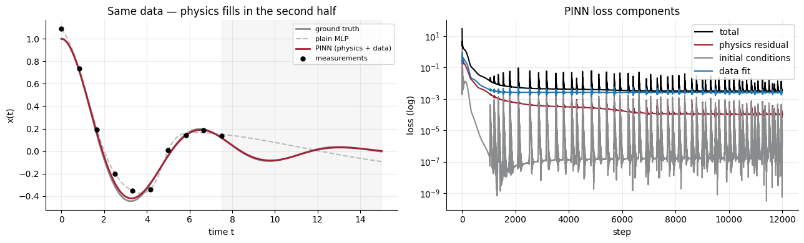
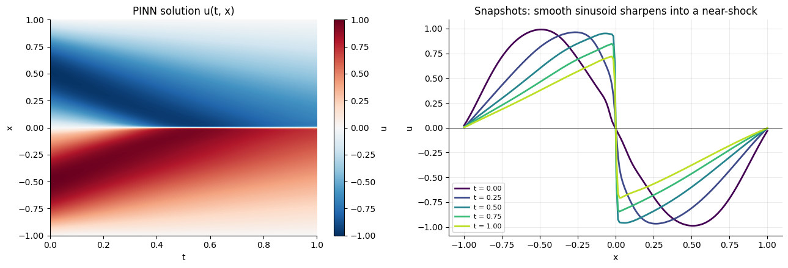
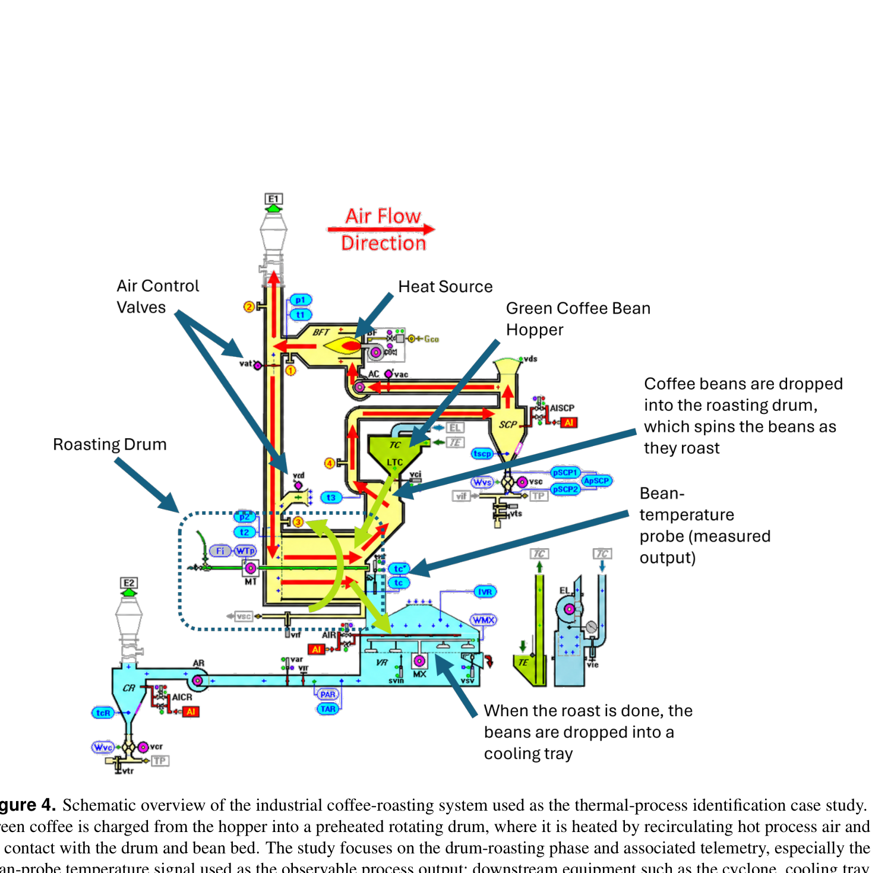
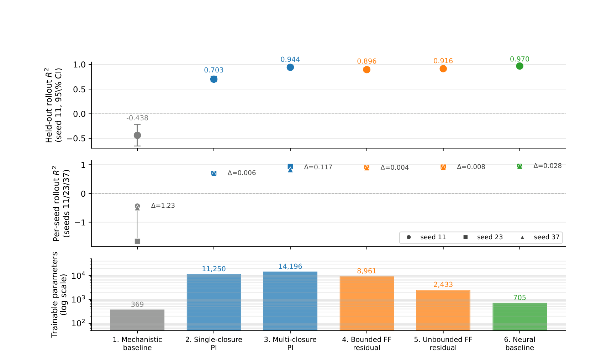
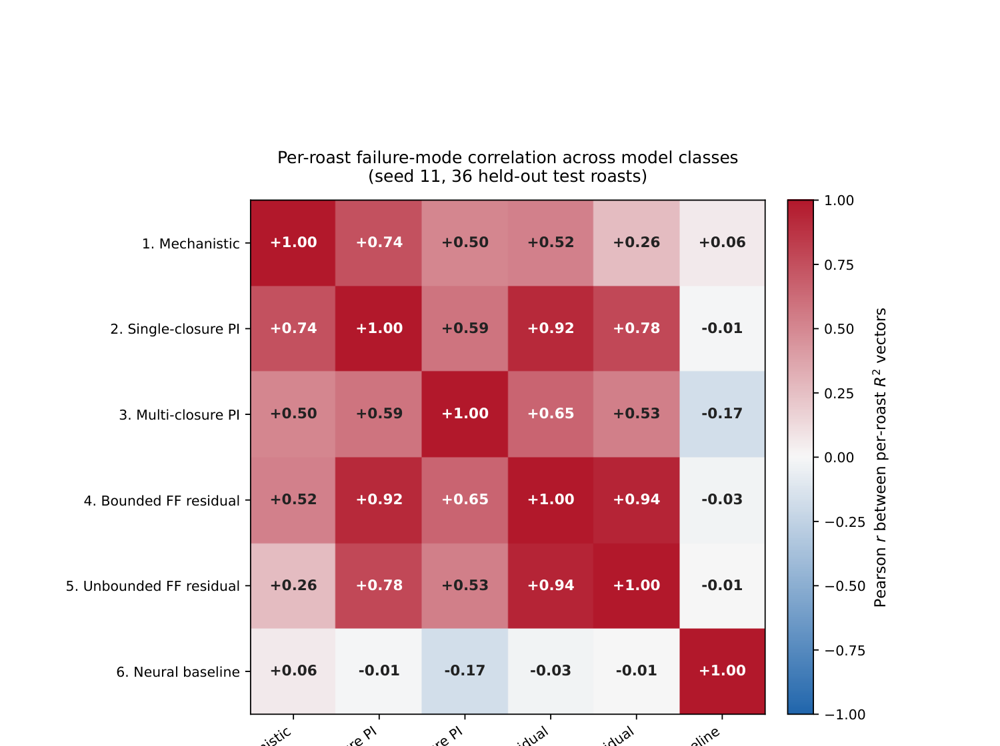

<!-- .slide: class="title-slide" -->

# Physics-Informed Machine Learning

<p class="subtitle">A practical introduction for industrial process modeling</p>

<div class="meta">
Morgen Pronk &nbsp;·&nbsp; MIT &nbsp;·&nbsp; guest lecture<br>
<em>Advanced Data Analytics for IIOT and Smart Manufacturing</em>
</div>

Note:
Welcome. Quick housekeeping: notebooks for the demos live in `notebooks/` in the repo — `01_damped_oscillator.ipynb` and `02_burgers.ipynb`. URL on the last slide. You don't need to run them now; we'll do that together.

---

## What we'll do in the next 50 minutes

1. **Motivation** — why combine physics and ML at all (~5 min)
2. **Neural networks in 10 minutes** — just enough to follow the rest (~10 min)
3. **The seminal arc** — Psichogios → Raissi → Karniadakis → Rackauckas (~10 min)
4. **Live demo** — a PINN built from scratch in PyTorch (~15 min)
5. **Sidebar** — what happens when you try this on real production data (~5 min)
6. **Practical guidance + Q&A** (~5 min)

<div class="callout">
The goal is <strong>intuition you can act on</strong>, not a literature review. By the end you should know when PIML is worth trying and how to spot when it isn't.
</div>

Note:
Tell them: feel free to ask questions throughout — this audience has hands in real systems, so domain pushback is welcome and useful. Mention that section 2 (NN basics) will be paced live based on how the room is doing.

---

<!-- .slide: class="section-divider" data-background-color="#A31F34" -->

<div class="section-num">Section 1</div>

# Why physics-informed ML?

The tension between mechanistic models and data-driven models

---

## Two ways to predict an industrial process

<div class="columns">

<div class="col">

### Mechanistic model
$\dot{T} = -\frac{hA}{mc\_p}(T - T\_\infty)$

- Built from first principles
- Few parameters, all physical
- **Extrapolates**, transfers across operating points
- Fails when reality breaks the assumptions or when run-specific parameters are unobserved

</div>

<div class="col">

### Pure ML model
$\hat{T}\_{t+1} = f\_\theta(T\_t, u\_t, \ldots)$

- Built from historical data
- Many parameters, all opaque
- **Interpolates** beautifully inside the training distribution
- Fails outside it, and tells you nothing about *why* something is wrong

</div>

</div>

<div class="callout">
Industrial reality usually has <em>some</em> physics that's right and <em>some</em> data that's available. PIML asks: what's the right way to use both?
</div>

Note:
Ground this in IIoT/smart-manufacturing terms: you have a control engineer who built a thermal model 15 years ago, and you have 5 years of SCADA telemetry. The mechanistic model is "right" but drifts run-to-run. The ML model fits historical data but blows up when the operator changes a setpoint. PIML is the bridge.

---

<!-- .slide: class="section-divider" data-background-color="#A31F34" -->

<div class="section-num">Section 2</div>

# Neural networks in 10 minutes

Just enough to understand what a PINN actually does

Note:
Skim or expand this section live based on the room. If they're nodding along, sprint through to the seminal arc. If they're frowning, slow down — the rest doesn't land without it.

---

## A neural network is just a function

A **multi-layer perceptron (MLP)** is:

$$ f\_\theta(x) = W\_L\\\,\sigma\\\!\bigl(W\_{L-1}\\\,\sigma(\cdots\\\,\sigma(W\_1 x + b\_1)\\\,\cdots) + b\_{L-1}\bigr) + b\_L $$

- $x$ — input (could be a number, a vector, anything you can flatten)
- $W\_\ell, b\_\ell$ — weights and biases at layer $\ell$ (these are what we learn)
- $\sigma$ — nonlinear "activation" applied elementwise (tanh, ReLU, sin, ...)
- $\theta$ — shorthand for *all* the weights and biases together

<div class="callout">
<strong>Universal approximation theorem (Cybenko 1989, Hornik 1991):</strong> with enough width, an MLP with one hidden layer can approximate any continuous function on a compact set, to any accuracy. The catch is "with enough width" — in practice we use deeper networks with smaller layers.
</div>

Note:
The takeaway isn't the equation, it's "this is a parameterized family of functions, very flexible, and we'll tune the parameters to make it do what we want." Compare to polynomial regression — same idea, much more expressive.

---

## Training = minimize a loss

Pick a **loss function** $\mathcal{L}(\theta)$ that measures how wrong $f\_\theta$ is. Common choice for regression:

$$ \mathcal{L}(\theta) = \frac{1}{N} \sum\_{i=1}^N \bigl(f\_\theta(x\_i) - y\_i\bigr)^2 $$

Then walk downhill with **gradient descent**:

$$ \theta \\\;\leftarrow\\\; \theta - \eta\\\,\nabla\_\theta \mathcal{L}(\theta) $$

with a small step size $\eta$ (the *learning rate*). Variants — Adam, SGD with momentum, L-BFGS — are all flavors of this. They all need one thing:

<div class="callout">
The gradient <strong>$\nabla\_\theta \mathcal{L}$</strong> — how each weight should change to reduce the loss. This is computed by <em>automatic differentiation</em>, and it's the same machinery that makes PIML possible.
</div>

Note:
Stress: training is *iterative*. We don't solve for the optimal $\theta$ — we walk towards it. Thousands of small updates. The loss curve is the thing you watch.

---

## Automatic differentiation: the magic ingredient

Every modern ML framework — PyTorch, JAX, TensorFlow — builds a *computation graph* as you run your code. When you ask for a gradient, it walks the graph backwards applying the chain rule.

```python
import torch

t = torch.tensor(1.5, requires_grad=True)
u = torch.sin(t) * torch.exp(-0.1 * t)   # any differentiable function of t

# First derivative
u_t = torch.autograd.grad(u, t, create_graph=True)[0]
# Second derivative — differentiate u_t with respect to t
u_tt = torch.autograd.grad(u_t, t)[0]

print(u.item(), u_t.item(), u_tt.item())
```

<div class="callout">
This is <strong>exact</strong> differentiation — no finite differences, no symbolic algebra. The same machinery that lets us compute $\partial \mathcal{L}/\partial \theta$ to train a network also lets us compute $\partial u\_\theta / \partial t$ to ask "does my network's output obey a differential equation?"
</div>

Note:
This is THE punchline of section 2. Everything in PIML follows from autodiff existing. If they get nothing else from this section, they should remember: the same tool that trains neural networks can differentiate the network's output with respect to its inputs, and that's how we bolt physics onto ML.

---

## A complete neural network, in 8 lines of PyTorch

```python
import torch.nn as nn

class MLP(nn.Module):
    def __init__(self, width=32, depth=3):
        super().__init__()
        layers = [nn.Linear(1, width), nn.Tanh()]
        for _ in range(depth - 1):
            layers += [nn.Linear(width, width), nn.Tanh()]
        layers += [nn.Linear(width, 1)]
        self.net = nn.Sequential(*layers)

    def forward(self, t):
        return self.net(t)
```

That's it. We'll use this exact class in the demo. Reading it:

- Takes a scalar input $t$, returns a scalar output $u\_\theta(t)$.
- 3 hidden layers, 32 units wide, tanh activations.
- About **2100 trainable parameters**. Tiny by ML standards. Huge by physics-model standards.

Note:
For an industrial audience: this is smaller than a typical Excel macro. Don't let the word "neural network" suggest GPT-4 — these are tiny.

---

## So what is a hybrid model?

Now you've seen the two ingredients — mechanistic equations and a neural network that can be differentiated by autograd. A **hybrid model** combines them. Three loose camps, all live in the literature:

1. **Physics as a loss term.** A standalone NN whose loss penalizes violations of a known equation. The "PINN" of Raissi 2019.
2. **Physics as structural scaffolding.** Embed a learnable NN *inside* a mechanistic ODE — let the equation carry what it knows, the NN fill the gaps. "Hybrid modeling," from Psichogios & Ungar 1992 to Universal Differential Equations.
3. **Physics as a baseline + ML correction.** Run the mechanistic model, learn an additive residual on top. Kennedy & O'Hagan 2001 in a Bayesian frame; "delta modeling" in engineering.

<div class="callout">
The same words ("physics-informed", "hybrid", "scientific ML") cover all three. The architecture matters less than <strong>where</strong> you place the learned component relative to the equation — we'll come back to this in the sidebar.
</div>

Note:
This slide is the pivot of the lecture. The audience now has both halves — the physics framing (Section 1) and the NN/autograd framing (Section 2) — and this is where they get sewn together. Walk slowly through the three camps; gesture at how each one uses the *same* underlying NN class we just saw but bolts it to the physics differently. Foreshadow the sidebar: my own paper benchmarks "where you place the NN" as the design variable holding architecture fixed, and the punchline is that placement matters more than architecture.

---

<!-- .slide: class="section-divider" data-background-color="#A31F34" -->

<div class="section-num">Section 3</div>

# The seminal arc

How we got from "hybrid models, 1992" to "physics-informed ML, today"

---

## 1992 — Psichogios & Ungar: hybrid first-principles + NN

The first time anyone put a neural network *inside* a process model and trained it to learn a single unknown rate function.

<div class="columns">

<div class="col">

**The setup.** Fed-batch bioreactor. Mass-balance ODEs are well known. The biomass growth rate $\mu(\cdot)$ is unknown and notoriously hard to model from first principles.

**The move.** Replace $\mu(\cdot)$ with a small MLP $\mu\_\theta(\cdot)$. Train the network so the ODE rollout matches the measured biomass trajectory.

</div>

<div class="col">

$$ \dot{X} = \mu\_\theta(S)\\\,X $$
$$ \dot{S} = -\frac{\mu\_\theta(S)\\\,X}{Y\_{X/S}} + F $$

Everything but $\mu\_\theta(\cdot)$ is mechanism. The MLP fills exactly one functional gap.

</div>

</div>

<div class="callout">
This is the lineage from which the broader "hybrid semi-parametric modeling" tradition grew — von Stosch 2014, Schweidtmann 2024 reviews — and it's directly what my own paper sits inside.
</div>

<div class="ref">
Psichogios & Ungar, "A hybrid neural network–first principles approach to process modeling," <em>AIChE Journal</em> 38, 1499–1511 (1992).
</div>

Note:
Make the historical point: people have been doing this for 30+ years in chemical engineering. The recent "PIML revolution" rediscovered and rebranded a lot of it. This isn't new technology — what's new is autodiff making it easy to scale and combine with PDEs.

---

## 2019 — Raissi, Perdikaris & Karniadakis: PINNs

The paper that made PIML a household name in the broader ML community.

**The move.** Take a neural network $u\_\theta(t, x)$ that predicts the *solution* of a PDE. Differentiate $u\_\theta$ with autograd to get $u\_t, u\_x, u\_{xx}, \ldots$ Plug into the PDE and minimize the residual on a grid of collocation points.

For a generic PDE $\mathcal{N}[u] = 0$ with boundary/initial conditions, the loss is:

$$ \mathcal{L}(\theta) = \underbrace{\frac{1}{N\_r}\sum\_i \mathcal{N}[u\_\theta](t\_i, x\_i)^2}\_{\text{physics residual}} \\\;+\\\; \lambda\_{\rm ic}\\\,\mathcal{L}\_{\rm IC} \\\;+\\\; \lambda\_{\rm bc}\\\,\mathcal{L}\_{\rm BC} \\\;+\\\; \lambda\_{\rm data}\\\,\mathcal{L}\_{\rm data} $$

<div class="callout">
The conceptual leap: <strong>the PDE itself is a loss</strong>. You don't need a mesh, you don't need a finite-difference scheme. Just a network, autograd, and points where you want the equation to hold.
</div>

<div class="ref">
Raissi, Perdikaris & Karniadakis, "Physics-informed neural networks: A deep learning framework for solving forward and inverse problems involving nonlinear partial differential equations," <em>J. Comput. Phys.</em> 378, 686–707 (2019).
</div>

Note:
This is the paper they should read first if they want to dig in. It's well written and the code is on GitHub. Also note: classical PINNs were originally for PDEs, but the residual-loss idea applies just as well to ODEs (we'll do an ODE PINN in the demo).

---

## What a PINN looks like operationally

<div class="columns">

<div class="col">

**Three sample sets:**

- **Data points** — where you have measurements (optional for forward problems)
- **IC/BC points** — where boundary or initial conditions are known
- **Collocation points** — random $(t, x)$ where the PDE should hold (free!)

One loss per set, summed with weights. Optimize end-to-end with Adam.

</div>

<div class="col">

```python
def loss(model, t_d, x_d, u_d,
         t_c, x_c):

    # Data
    L_data = ((model(t_d, x_d) - u_d)**2).mean()

    # Physics: u_t + u u_x - nu u_xx
    u = model(t_c, x_c)
    u_t  = grad(u, t_c)
    u_x  = grad(u, x_c)
    u_xx = grad(u_x, x_c)
    r = u_t + u * u_x - nu * u_xx
    L_phys = (r**2).mean()

    return L_data + L_phys
```

</div>

</div>

Note:
This is the entire algorithm. Less than a screen of code. Everything else is bookkeeping — sampling strategy, loss weights, network width, optimizer schedule. The math is one screen.

---

## 2021 — Karniadakis et al.: PIML as a taxonomy

A *Nature Reviews Physics* article that zooms out from PINNs and surveys the whole landscape — including approaches that don't look like PINNs at all.

**The taxonomy that matters for us:** three ways to inject physics into ML:

- **Observational bias** — choose training data that already respects the physics (e.g., simulator-generated)
- **Inductive bias** — bake symmetries / conservation laws into the *architecture* (e.g., divergence-free networks, equivariant networks)
- **Learning bias** — penalize violations via a *loss term* (this is the PINN approach)

<div class="callout">
Most industrial PIML is a mix of the second and third. "Hybrid model" usually means a known mechanistic structure (architecture-level bias) with an MLP learning a closure (loss-level fit). Pick your slot deliberately.
</div>

<div class="ref">
Karniadakis, Kevrekidis, Lu, Perdikaris, Wang & Yang, "Physics-informed machine learning," <em>Nature Reviews Physics</em> 3, 422–440 (2021).
</div>

Note:
This is the survey paper to give to engineers who want to understand the field without getting lost in PINN-specific tricks. It's the lens through which my paper is framed (broad hybrid sense, not narrow PINN sense).

---

## 2020 — Rackauckas et al.: Universal Differential Equations

The "SciML" branch of the family. Take any equation — ODE, SDE, PDE, DAE — and let any or all of its terms be a neural network.

$$ \dot{x} = \underbrace{f(x, t)}\_{\text{known physics}} + \underbrace{g\_\theta(x, t)}\_{\text{learnable closure}} $$

**What's universal about it.** You can plug an MLP into the right-hand side of *any* differential equation and train it by differentiating through the ODE solver itself ("differentiable simulation"). Implemented as `DifferentialEquations.jl` + `Flux.jl` in Julia, with PyTorch/JAX equivalents.

<div class="callout">
This is the modern incarnation of Psichogios & Ungar 1992 — same idea, industrial-grade tooling. When people say "Scientific Machine Learning" or "SciML", this framework is usually what they mean.
</div>

<div class="ref">
Rackauckas <em>et al.</em>, "Universal differential equations for scientific machine learning," <em>arXiv:2001.04385</em> (2020).
</div>

Note:
For the audience: if their problem is "I have an ODE and one term in it is hard to write down," UDEs are the right starting point — not PINNs. PINNs are for solving known PDEs; UDEs are for discovering parts of unknown ones.

---

## Two more families to know exist (briefly)

<div class="columns">

<div class="col">

### Operator learning

Learn the *mapping from input function to output function*, not a single solution.

- **DeepONet** (Lu et al. 2021)
- **Fourier Neural Operator** (Li et al. 2021)

For when you need to re-solve a parameterized PDE family fast — e.g., "give me $u$ for any new IC."

</div>

<div class="col">

### Neural ODEs

Treat the *whole* dynamics as a neural network and integrate it with a standard ODE solver.

- **Chen et al. 2018** — the original
- **NeuralSDE, NeuralCDE** — stochastic and controlled variants

For when you have time series but no good mechanistic skeleton.

</div>

</div>

<div class="callout">
These don't get their own demo today, but the same autodiff-driven recipe sits underneath them. If you remember one cross-cutting idea from this section, it's this: <strong>autodiff makes physics composable with optimization</strong>.
</div>

Note:
If you have time, mention that operator learning is what you'd want for design-space exploration ("what if I changed the geometry of the reactor?"). Neural ODEs are what you'd want for time-series modeling where you don't trust a hand-written ODE structure.

---

<!-- .slide: class="section-divider" data-background-color="#A31F34" -->

<div class="section-num">Section 4</div>

# Demo time

Two notebooks, both in PyTorch, both runnable on a laptop CPU

---

## From oscillator data to a trained PINN — the recipe

<div class="columns">

<div class="col">

**1. Pack what you know into tensors**

- `t_data`, `x_data` — shape `[10, 1]` each — the 10 noisy measurements
- `t_coll` — shape `[200, 1]` — physics-only points, **no measurements needed**
- Known physics: $m\ddot{x} + c\dot{x} + kx = 0$
- Known ICs: $x(0)=1, \dot{x}(0)=0$

**2. Build a scalar→scalar MLP**

```python
class MLP(nn.Module):
    def forward(self, t):    # input  [N, 1]
        t = 2*t/T - 1        # normalize → [-1, 1]
        return self.net(t)   # output [N, 1]
```

Width 48, depth 3, tanh. ~5k params.

</div>

<div class="col">

**3. Compute three losses each step**

Call the *same* MLP three times — autograd handles the derivatives:

```python
# data fit (10 points)
L_data = ((MLP(t_data) - x_data)**2).mean()

# physics residual (200 points)
u    = MLP(t_coll)
u_t  = autograd.grad(u,   t_coll)[0]
u_tt = autograd.grad(u_t, t_coll)[0]
L_phys = ((m*u_tt + c*u_t + k*u)**2).mean()

# anchor IC at t = 0
L_ic = (MLP(0)-1)**2 + (MLP'(0))**2
```

**4. Sum, backprop, Adam.** 12k steps.

$$ \mathcal{L} = 5\\,\mathcal{L}\_{\rm phys} + 20\\,\mathcal{L}\_{\rm ic} + \mathcal{L}\_{\rm data} $$

</div>

</div>

<div class="callout">
<strong>The whole story in one line:</strong> the data turns the network into <em>a fit to those 10 points</em>; the physics-residual at the 200 free collocation points turns it into <em>a fit to the equation everywhere else</em>. Same MLP, evaluated three places.
</div>

Note:
The point of this slide is to show that the leap from "I have data" to "I have a trained PINN" is small and concrete. Walk through the tensors first — most engineers haven't seen the `[N, 1]` convention. Then point at the MLP — it's tiny (~5k params). Then the callout's "one MLP, called three times" is the punchline: students need to see that the physics-residual is *the same network*, just evaluated at different times with autograd doing the derivatives. Then move to the result on the next slide.

---

## Demo 1 — Damped oscillator (forward + inverse)

$$ m\\\,\ddot{x} + c\\\,\dot{x} + k\\\,x = 0 \qquad\text{with}\ x(0)=1,\ \dot{x}(0)=0 $$



<div class="caption">
Same <strong>10 noisy points</strong> in the first half of the window (shaded). Plain MLP (dashed) drifts where it has no data. <strong>PINN</strong> (red) follows the truth across the whole window — same data, plus the physics residual. The loss-curve panel shows the three terms (physics, IC, data) being driven down together.
</div>

Note:
Open `notebooks/01_damped_oscillator.ipynb` and run cell by cell. The plot on this slide is what cell 5 produces — wait for the room to absorb the contrast (plain MLP drifts in the unobserved half, PINN doesn't) before moving on. Then cell 6 runs the inverse problem: `c` becomes a trainable parameter and the network recovers `c ≈ 0.5` from the same 10 noisy points. Killer industrial framing: "you have physics that's structurally right with one or two coefficients that drift batch-to-batch — fit them from telemetry." Stay on this notebook until the "physics fills the gap" intuition lands.

---

## Demo 2 — Burgers' equation (canonical PDE PINN)

$$ u\_t + u\\\,u\_x - \nu\\\,u\_{xx} = 0, \qquad u(0, x) = -\sin(\pi x), \qquad u(t, \pm 1) = 0 $$



<div class="caption">
A 2-input MLP ($t, x \to u$) trained with three losses: physics residual + initial condition + boundary. <strong>No mesh, no finite differences</strong> — just <code>torch.autograd.grad</code>. Left: learned $u(t, x)$. Right: snapshots showing the smooth sinusoid sharpening into a near-shock around $x=0$.
</div>

Note:
Open `notebooks/02_burgers.ipynb`. If time is short, just run all cells and show the final heatmap + snapshots — the audience gets the visual. If time allows, walk through the loss components and discuss why the IC weight needs to be 10× larger than the physics weight (otherwise the network collapses to u=0). The deeper point isn't that PINNs replace traditional solvers — a finite-difference scheme still wins on accuracy and wall-clock for this problem. It's that the *same* MLP-plus-autodiff machinery handles forward solves, inverse problems, and embedding ML into known equations.

---

<!-- .slide: class="section-divider" data-background-color="#A31F34" -->

<div class="section-num">Section 5</div>

# Sidebar — from textbook PINNs to industrial reality

When you take this off the math textbook and onto production telemetry

---

## The setting: industrial coffee roasting



<div class="caption">
A drum roaster: green beans charged into a hot rotating drum, heated by recirculating air. The only thing the SCADA records every second is the <em>bean-probe temperature</em> — one sensor sitting in the bean bed.
</div>

Note:
Why coffee roasting? It's a classic batch thermal process: nonlinear heat and mass transfer, an unobserved internal state (moisture, reaction extent), and the operators care about reproducing a target temperature profile. It's also a setting where I had 221 production roasts of real data from an industrial partner.

---

## The mechanistic model "works"... in a textbook

A standard 4-state ODE from the heat-and-mass-transfer literature:

$$ x = [\\\,T\_b,\ X\_b,\ H\_e,\ T\_{rp}\\\,]^\top $$

(bean temperature, moisture ratio, reaction-energy state, probe-readout state)

It has $\sim$13 physical parameters — heat-transfer coefficient $h\_e$, contact area $A\_b$, kinetic prefactors, activation energies, etc.

<div class="callout">
With <strong>literature-defaults plus run-specific initial conditions identified from per-roast metadata</strong>, this model reproduces production trajectories at $R^2 \approx 0.93$. Great.<br><br>
<strong>Production telemetry doesn't record those initial conditions.</strong> Without them, autonomous rollout drops to $R^2 = -0.44$. That's the gap PIML has to repair.
</div>

Note:
This is the practical pain point: physics that works in a lab where you can measure everything, but fails on production data where you only have what the SCADA records. Very common in IIoT — sensors selected for control, not for model identification.

---

## The design variable: *where* does the NN plug in?

We tested **six placements** of a learned MLP relative to the same mechanistic ODE:



<div class="caption">
Mechanistic only → MLP inside the ODE as one or three learned closures → MLP on top as a bounded/unbounded residual correction → standalone NN with no physics. All six use the same MLP family; the only thing that changes is <strong>where</strong> it sits.
</div>

Note:
Walk them through the spectrum top to bottom: mechanistic baseline at R²=-0.44 (broken without init metadata), every PIML repair recovers significant trajectory fidelity (0.70 to 0.94), and the standalone neural baseline hits 0.97 with 3-20x fewer parameters.

---

## Headline finding #1: the compact NN matches PIML

- All four PIML repairs lift $R^2$ from $-0.44$ to between $0.70$ and $0.94$.
- The standalone neural baseline reaches $R^2 = 0.97$ with **705 trainable parameters** — 3 to 20 times fewer than any PIML variant tested.
- The bounded residual costs more than it buys: removing the $\pm 24\\\,\text{K}$ bound *improves* $R^2$ by 0.02 *and* uses 3.7× fewer parameters.

<div class="callout">
For this metadata-limited cohort, on accuracy and parameter-efficiency alone, the empirical baseline is at least as good as any PIML repair. <strong>Adding physics didn't automatically pay off.</strong>
</div>

Note:
Important to handle this carefully — don't oversell it as "physics is useless." The story is more interesting: there's a SECOND finding that says they're actually complements.

---

## Headline finding #2: orthogonal failure modes



<div class="caption">
Per-roast $R^2$ correlation across the six model classes. The PIML repairs (rows/cols 2–5) form a high-correlation block — they share their hard roasts. The neural baseline (row/col 6) is <strong>uncorrelated</strong> with every PIML repair: it finds different roasts hard.
</div>

Note:
This is the slide that flips the story. Same predictive ceiling, but structurally different per-roast failure profiles. That's the configuration where ensembling/combination is genuinely additive. The two approaches are complements, not substitutes — which is the actionable takeaway.

---

## What that means practically

<div class="callout">
For metadata-limited industrial telemetry — the regime most IIoT teams actually live in — <strong>build both</strong> a compact empirical model and a physics-scaffolded model. The gap between them tells you which dynamics fall outside the chosen physics. If they fail on the same roasts, your physics is doing the work; if they fail on different roasts, they're complementary and you should ensemble.
</div>

**Three structural lessons that generalize beyond coffee:**

1. **Placement is the first design choice**, not architecture. Whether the NN sits inside the ODE, on top of it, or replaces it changes everything.
2. **Bounded corrections cost more than they buy** if the bound is tighter than the underlying error.
3. **Always train a compact empirical baseline.** It's the only honest reference point for whether your physics is paying its way.

<div class="ref">
Pronk & Anthony, "Neural-network placement in physics-informed machine learning for mechanistic process-model repair: a case study in industrial coffee roasting" (2025). Code: <code>github.com/MorgenPronk/physics-informed-roast-rollout-comparison</code>
</div>

Note:
Land this slide hard. It's the single most actionable transfer from my paper to their day jobs. Most PIML talks they've seen will have said "physics is always better" — push back on that.

---

<!-- .slide: class="section-divider" data-background-color="#A31F34" -->

<div class="section-num">Section 6</div>

# Practical guidance

When PIML is worth your time, and when it isn't

---

## When PIML pays off

- **You have a good mechanistic model but unknown coefficients** — inverse PINNs / UDEs are made for this. Damped-oscillator demo, scaled up.
- **Data is sparse but physics is rich** — physics constraints fill in regions where you have no measurements. Most useful in early-stage process development.
- **You need extrapolation to new operating points** — pure ML interpolates; physics-informed methods inherit whatever extrapolation the underlying equations have.
- **You need interpretability** — when a coefficient has a physical meaning, learning it as a parameter (vs. burying it in MLP weights) gives you something you can argue about.

Note:
Concrete example for each: (1) batch reactor with unknown kinetic prefactor, (2) startup-phase modeling with 3 batches of data, (3) scale-up from pilot to production, (4) anything where regulators or process engineers need to sign off on the model.

---

## When PIML doesn't pay off (or actively hurts)

- **Data is plentiful and IID** — a compact MLP trained on enough data will match or beat PIML and is far cheaper to train and maintain.
- **Your "physics" is wrong** — PIML inherits the structural errors of the mechanistic skeleton. Garbage equation in, garbage trajectory out.
- **You can't supply the run-specific inputs the physics needs** — the model that works in the lab will fail on production data if the lab measurements aren't in the SCADA archive.
- **Loss-weight tuning is dominating your time budget** — PINN losses are notoriously sensitive to the relative weights. If you're spending more time tuning $\lambda$'s than improving the model, switch to a cleaner framework (UDEs, hybrid semi-parametric models).

<div class="callout">
The honest test: <strong>build both PIML and a compact baseline.</strong> Compare on held-out runs. If they agree, the physics is paying its way. If they don't, you've learned something either way.
</div>

Note:
This is the slide to use if someone asks "should we add PIML to our existing model?" — the answer is "always train the baseline first, then decide."

---

## A starter checklist for your own problem

1. **Write down the mechanistic skeleton.** Even if approximate. Use only state variables you can either measure or initialize from telemetry.
2. **Decide where the NN plugs in.** Inside the equation (closure), on top of it (residual), or replacing it (baseline).
3. **Build the compact baseline first.** Standalone MLP on the same inputs. This is your benchmark; never skip it.
4. **Pick a tooling stack.** PyTorch for PINNs, DifferentialEquations.jl + Flux for UDEs, DeepXDE if you want a high-level library.
5. **Hold out test runs, not test points.** For dynamic models, splitting *within* a run leaks state. Always split *between* runs.
6. **Report seed stability.** Single-seed results lie. Train 3+ seeds, report the range.

Note:
Items 5 and 6 are where most industrial PIML pilots quietly fail — internal results look great because of subtle data leakage and lucky seeds.

---

<!-- .slide: class="section-divider" data-background-color="#A31F34" -->

# Thanks

Questions, pushback, war stories from your own systems — all welcome

---

## Further reading

**Seminal papers (in order):**

- Psichogios & Ungar 1992 — *AIChE J* 38 — origin of hybrid first-principles + NN
- Raissi, Perdikaris & Karniadakis 2019 — *J. Comput. Phys.* 378 — PINNs
- Rackauckas et al. 2020 — *arXiv:2001.04385* — Universal Differential Equations
- Karniadakis et al. 2021 — *Nat. Rev. Phys.* 3 — the survey

**Reviews and tutorials:**

- Schweidtmann et al. 2024 — *Digital Chemical Engineering* 10 — hybrid modeling review
- DeepXDE library tutorials — `deepxde.readthedocs.io`

**This talk's materials:**

- Slides + notebooks: **`github.com/MorgenPronk/intro-to-piml`**
- My paper: `main.pdf` in the repo above
- Code + data for my paper: `github.com/MorgenPronk/physics-informed-roast-rollout-comparison`

**Contact:** morgenpronk@alum.mit.edu

Note:
End on something they can actually pick up tomorrow morning. The two notebooks are the most concrete deliverable; the Karniadakis review is the best single paper to read if they only read one.
